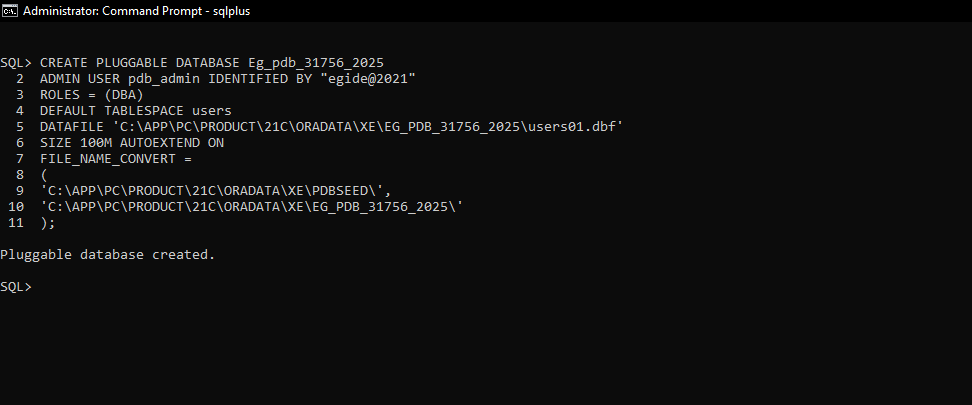
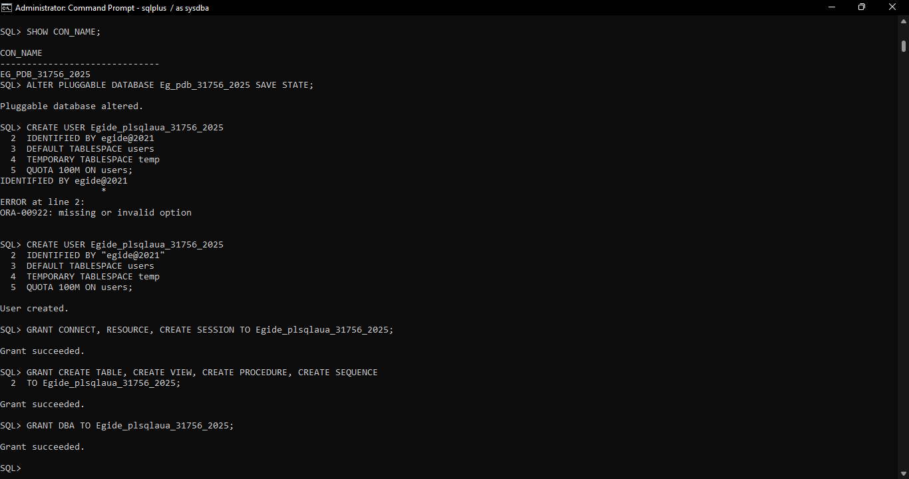
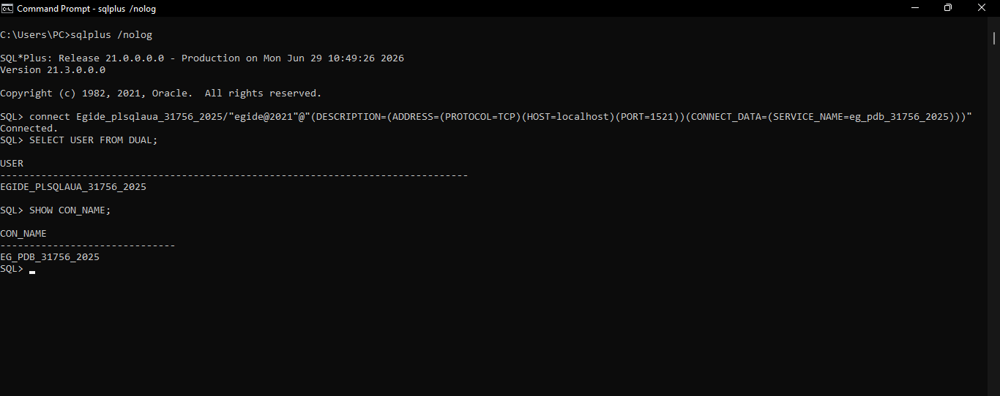
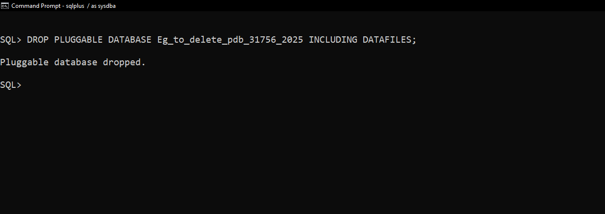
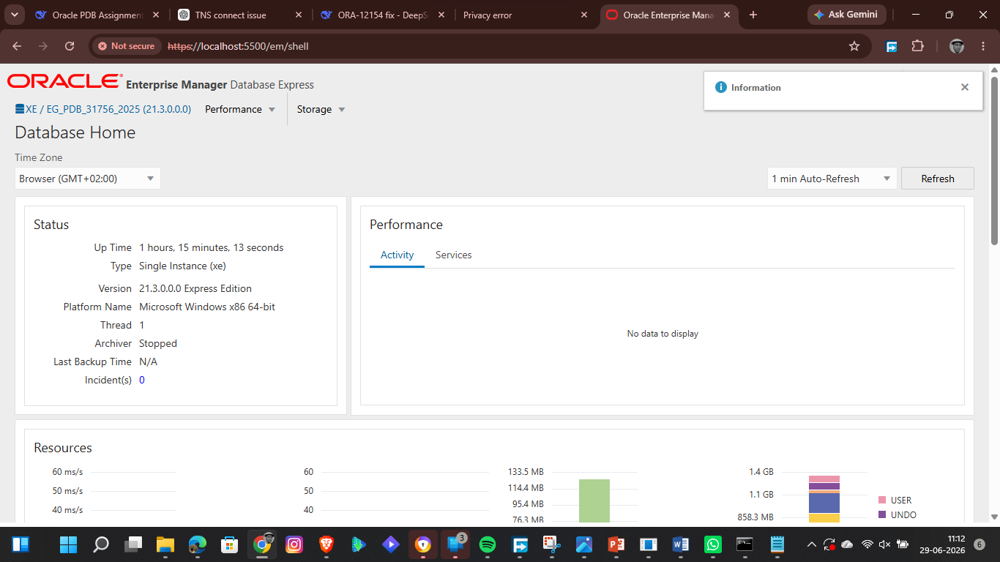

# Oracle PDB Administration Assignment 2

## Assignment Overview
This individual practical assignment demonstrates hands-on administration of Oracle Multitenant Architecture. It covers the creation of permanent and temporary Pluggable Databases (PDBs), user management, access via Oracle Enterprise Manager (EM) Express, and professional documentation using GitHub.

**Student:** Egide  
**Student ID:** 31756-2025  
**Course:** C11665 – DPR400210: Database Programming  
**Instructor:** Eric Maniraguha  
**Date:** June 29, 2026  

---

## Oracle Environment

| Component | Details |
|-----------|---------|
| **Oracle Version** | Oracle Database 21c Express Edition (Release 21.0.0.0.0) |
| **Operating System** | Microsoft Windows 10 (64-bit) |
| **Tools Used** | SQL*Plus, Oracle Enterprise Manager (EM Express) |
| **Container Database (CDB)** | `XE` |
| **EM Express Port** | 5500 (HTTPS) |

---

## Task 1: Create and Configure Permanent PDB

### Naming Convention (Applied)
- **PDB Name:** `Eg_pdb_31756_2025` *(Format: FirstTwoLetters_pdb_StudentID)*
- **Admin User:** `pdb_admin` (created during PDB creation)
- **Application User:** `Egide_plsqlauca_31756_2025` *(Format: FirstName_plsqlauca_StudentID)*

### Privileges Granted
`CONNECT`, `RESOURCE`, `CREATE SESSION`, `CREATE TABLE`, `CREATE VIEW`, `CREATE PROCEDURE`, `CREATE SEQUENCE`, `DBA`

### Process Overview
1. Connected as SYSDBA to the Root Container (`CDB$ROOT`).
2. Executed `CREATE PLUGGABLE DATABASE` with Windows-specific `FILE_NAME_CONVERT`.
3. Opened the PDB and saved its state (`ALTER PLUGGABLE DATABASE ... OPEN; SAVE STATE;`).
4. Switched to the new PDB and created the user `Egide_plsqlauca_31756_2025`.
5. Granted the required privileges.
6. Verified login using the Full Connect Descriptor (to bypass local TNS resolution issues).

### Screenshots

| Step | Screenshot |
|------|------------|
| PDB Creation |  |
| User Creation |  |
| Successful Login |  |

---

## Task 2: Create and Delete Temporary PDB

### Naming Convention (Applied)
- **Temporary PDB Name:** `Eg_to_delete_pdb_31756_2025` *(Format: FirstTwoLetters_to_delete_pdb_StudentID)*

### Process Overview
1. Connected as SYSDBA to `CDB$ROOT`.
2. Created the temporary PDB using the correct Windows seed path.
3. Verified the PDB existed using `SELECT name FROM v$pdbs`.
4. Opened the PDB to ensure it was functional.
5. Dropped the PDB permanently using `DROP PLUGGABLE DATABASE ... INCLUDING DATAFILES;`.
6. Confirmed deletion by querying `v$pdbs` (returned no rows).

### Screenshots

| Step | Screenshot |
|------|------------|
| Temporary PDB Creation |  |
| Temporary PDB Deletion |  |

---

## Task 3: Oracle Enterprise Manager (EM) Express

### Access Information
- **URL:** `https://localhost:5500/em`
- **Username:** `system`
- **Container Selected:** `Eg_pdb_31756_2025`

### Process Overview
1. Accessed EM Express via browser (bypassed the self-signed certificate privacy error).
2. Logged in with the `system` user.
3. Selected the `Eg_pdb_31756_2025` container upon login.
4. Explored the dashboard to view database status, instance details, and PDB information.

### Screenshots

| Step | Screenshot |
|------|------------|
| OEM Dashboard |  |

---

## Challenges Encountered & Solutions

### 1. TNS Connectivity Issue (ORA-12154)
- **Problem:** `sqlplus` failed to resolve the connect identifier even though `tnsping` worked.
- **Root Cause:** Two different Oracle homes existed on the machine (`OraDB21Home1` vs `dbhomeXE`). `tnsping` used one, but `sqlplus` defaulted to the other which lacked the TNS entry.
- **Solution:** Used the **Full Connect Descriptor** to bypass `tnsnames.ora` entirely, ensuring consistent connectivity.

### 2. ORA-65040 (Operation not allowed from within a PDB)
- **Problem:** Attempted to run `CREATE PLUGGABLE DATABASE` while connected to a PDB.
- **Solution:** Reconnected as `SYSDBA` to the root container (`CDB$ROOT`) and executed the DDL successfully.

### 3. ORA-65005 (Invalid File Name Pattern)
- **Problem:** Used Linux-style paths (`/u01/...`) for `FILE_NAME_CONVERT` on a Windows machine.
- **Solution:** Updated the source path to match the actual Windows seed location: `C:\APP\PC\PRODUCT\21C\ORADATA\XE\PDBSEED\`.

---

## Lessons Learned

- **Oracle Multitenant Architecture:** Understood the clear distinction between the Root Container (CDB) and Pluggable Databases (PDBs), especially regarding where administrative DDL commands must be executed.
- **Troubleshooting:** Gained practical experience in diagnosing and resolving TNS resolution conflicts caused by multiple Oracle homes.
- **Documentation:** Learned the importance of precise screenshot naming and folder structuring for professional GitHub submissions.

---

## Integrity Statement

> *"I confirm that this assignment represents my own practical work, screenshots, and documentation. All external resources consulted have been properly acknowledged. The PDBs, users, and configurations shown in this repository were created and managed entirely by me."*

**Egide**  
**Student ID: 31756-2025**
